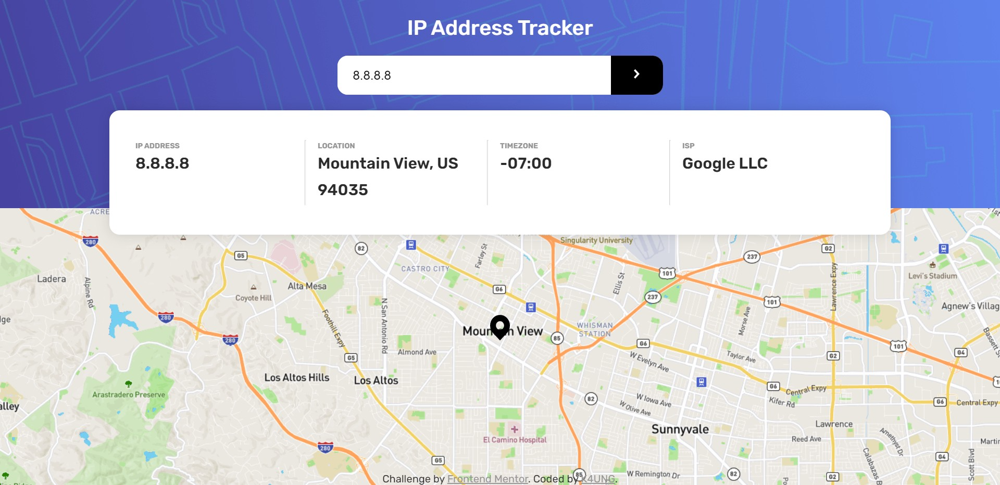

# Frontend Mentor - IP address tracker solution

This is a solution to the [IP address tracker challenge on Frontend Mentor](https://www.frontendmentor.io/challenges/ip-address-tracker-I8-0yYAH0). Frontend Mentor challenges help you improve your coding skills by building realistic projects. 

## Table of contents

- [Overview](#overview)
  - [The challenge](#the-challenge)
  - [Screenshot](#screenshot)
  - [Links](#links)
- [My process](#my-process)
  - [Built with](#built-with)
  - [What I learned](#what-i-learned)

### Screenshot

### Links

- Solution URL: [Solution URL](https://github.com/K4UNG/project-19-ip-address-tracker-frontendmentor)
- Live Site URL: [Live URL](https://k4ung19.netlify.app)

## My process

### Built with

- Semantic HTML5 markup
- CSS custom properties
- JavaScript

### What I learned

I learned a lot about working with external APIs. I had quite a bit of hard time reading the Docs because this is my first time doing it on my own. But I eventually figured it out :)